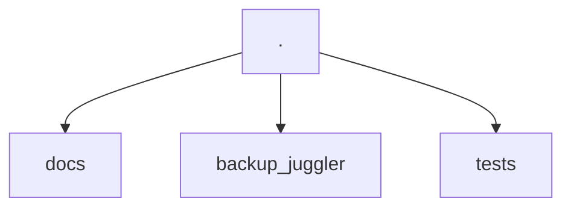
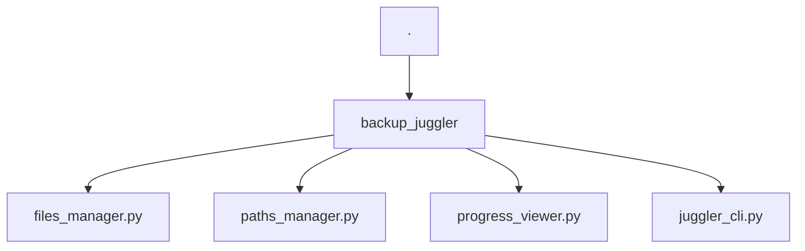
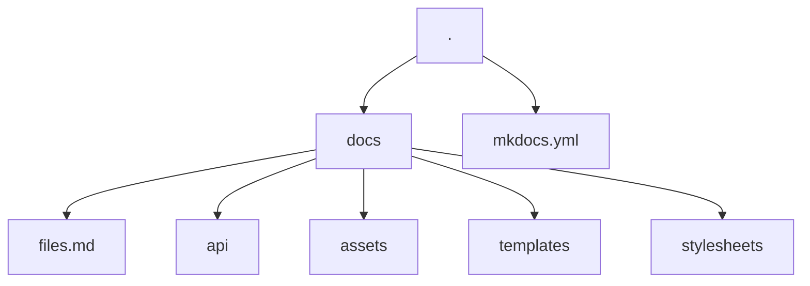

# How to contribute
Thank you for taking an interest in contributing to the Backup Juggler project. Listed in this document are the most common operations you may need to contribute.

## How does the project work?

### Project structure


The project is divided into three directories: `docs`, `backup_juggler` and `tests`. Each directory has its own specific function.

#### backup_juggler


The CLI and library code and the API code documentation are being made in `backup_juggler`, using the [mkdocstrings](https://mkdocstrings.github.io/) tool and follow the [google docstrings](https://sphinxcontrib-napoleon.readthedocs.io/en/latest/example_google.html) standard. So if you change something in the code, remember to update the docstrings as well.

#### The CLI
The CLI was created using the [Typer](https://typer.tiangolo.com/) library, and you can refer to its documentation for more details if you want to expand the functionality of the CLI.

For the detailed answers in the output of the application, the [Rich](https://rich.readthedocs.io/en/stable/introduction.html) library was used. If you want to change something in the tables generated in the output, you can go directly to the [documentation page](https://rich.readthedocs.io/en/stable/tables.html) for the tables.

The only convention you are following regarding the CLI is that you have already defined a Rich `Console` object and a `Typer` application.

```py title="backup_juggler/juggler_cli.py"
from rich.console import Console
from typer import Typer

...

console = Console()
app = Typer()
```

#### Tests
For the tests we are using pytest. Its settings can be found in the pyproject.toml file at the root of our project.

The test coverage is being generated automatically with pytest-cov and is displayed when the test task is executed:

```bash
task tests
```

Just as linters are requirements for these tests.

#### Documentation
All documentation is based on using [mkdocs](https://www.mkdocs.org/) with the [mkdocs-material](https://squidfunk.github.io/mkdocs-material/) theme.



All configuration can be found in the [mkdocs.yml](https://github.com/Raulin0/backup-juggler/blob/main/mkdocs.yml) file in the repository root.

Additionally, various gimmicks are being used to supplement the documentation. For example, [jinja](https://jinja.palletsprojects.com/en/3.1.x/) templates in places where instructions may repeat themselves. If you find blocks like:

```html
{ %  % }
```

Templates are defined in the `/docs/templates directory`. In some cases, however, they can be called by variables with `commands.run` that appears in almost all documentation files. These macros are being made with [mkdocs-macros](https://mkdocs-macros-plugin.readthedocs.io/en/latest/) and are defined in the mkdocs configuration file:

```yaml
extra:
  commands:
    run: bj
```

##### API Documentation
The API documentation is being done inside the code modules. This is why the files in the `docs/api` directory have a tag:

```md
::: module
```

This means that the code contained in the docstrings will be used in this block. The plug-in [mkdocstrings](https://mkdocstrings.github.io/) is being used to take care of this.

The documentation in the modules follows the format of [google docstrings](https://sphinxcontrib-napoleon.readthedocs.io/en/latest/example_google.html), which is the library standard.

## Tools
This project basically uses two tools as a basis for everything with control:

- [Poetry](https://python-poetry.org/): For environment management and library installation
- [Taskipy](https://github.com/illBeRoy/taskipy): For automation of routine tasks. Like running tests, linters, documentation, and so on.

So make sure you have Poetry installed for this contribution:

```bash
pipx install poetry
```

## Contributing Process
To contribute to the Backup Juggler project, please follow these steps:

1. Fork the repository on GitHub.
2. Clone your forked repository to your local machine.
	```bash
	git clone https://github.com/Raulin0/backup-juggler.git
	```
3. Install dependencies
	```bash
	poetry install
	```
4. Use Git Flow as your workflow to help organize the versioning of your code.
	```mermaid
	graph LR
		
		subgraph Main Branches
		M(Master Branch)
		D(Develop Branch)
		end

		subgraph Hotfix Branches
		H(Hotfix Branch)
		end

		subgraph Feature Branches
		F(Feature Branch)
		end

		subgraph Release Branches
		R(Release Branch)
		end

		T(Tag)

		style M fill:#f6cd4c, stroke:#bf9000
		style H fill:#ff4f3f, stroke:#db4437
		style D fill:#00a884, stroke:#008e70
		style F fill:#00fdc8, stroke:#00dfb0
		style R fill:#00fdc8, stroke:#6aa84f
		

		M -- Hotfixes --> H
		H -- Merge --> M
		H -- Merge --> D
		H -- Close --> T

		D -- Features --> F
		F -- Merge --> D
		D -- Releases --> R

		R -- Merge --> M
		R -- Merge in case of a bugfix --> D
		R -- Close --> T
	```
	Git Flow works with two main branches, Develop and Master, which last forever; and three supporting branches, Feature, Release and Hotfix, which are temporary and last until you merge with the main branches.
	So instead of a single Master branch, this workflow uses two main branches to record the project's history. The Master branch stores the official release history, and the Develop branch serves as a merge branch for features.
	Ideally, all commits in the Master branch are marked with a version number.
	- **Master/Main Branch**: where we have all the production code. All new features that are being developed, at some point, will be merged or associated with the Master. The ways to interact with this branch are through a Hotfix or a new Release.
	- **Develop Branch**: where the code for the next deployment is located. It serves as a timeline with the latest developments, this means that it has features which have not yet been published and which will later be associated with the Master branch.
	- **Feature Branch**: used for the development of specific features. It is recommended that these branches follow a naming convention, the most used convention is to start the branch name with feature, for example, "feature/feature-name". It is important to know that these feature branches are always created from the Develop branch. Therefore, when they are finished, they are removed after performing the merge with the Develop branch. If we have ten features to develop, we create ten independent branches. It is important to note that feature branches cannot have interaction with the master branch, only with the develop branch.
	- **Hotfix Branch**: created from the master to make immediate fixes found in the production system. When completed, it is deleted after merge with the master and develop branches. We have a hotfix branch for every hotfix we need to implement! The big difference between Feature Branches and Hotfix Branches is that Hotfixes are created from the Master Branch and when we finish them, they are merged into both the Master Branch and the Develop Branch. This is because the bug is in both environments. Also, when we close a Branch Hotfix, we have to create a tag with the new project version. This is because every change we make in the Branch Master needs a tag that represents it.
	- **Release Branch**: serves as a bridge for merge from Develop to Master. It works as a testing environment and is removed after the merge tests with the Master. If a bug is found and changes are made, it must also be synchronized with the Develop Release. Finally, when we close a Branch Release, we have to create a tag with the new release version of the software, so that we can have a complete history of the development.
5. Make the necessary changes to the codebase.
6. Perform code verification and run the tests locally to ensure that everything is working correctly.
	```bash
	task test
	```
7. Commit your changes with a descriptive commit message using the conventional commit format.
	```bash
	<type>[optional scope]: <description>
	[optional body]
	[optional footer]
	```
	We recommend that you use Commitizen as a version management tool designed for teams.
	Commitizen assumes that your team uses a standard form of commit rules, and from that foundation you can version your project, create the changelog, and update files.
	```bash
	cz --help
	usage: cz [-h] [--debug] [-n NAME] [-nr NO_RAISE] {init,commit,c,ls,example,info,schema,bump,changelog,ch,check,version} ...
	Commitizen is a cli tool to generate conventional commits.
	For more information about the topic go to https://conventionalcommits.org/
	optional arguments:
	-h, --help            show this help message and exit
	--debug               use debug mode
	-n NAME, --name NAME  use the given commitizen (default: cz_conventional_commits)
	-nr NO_RAISE, --no-raise NO_RAISE
							comma separated error codes that won't rise error, e.g: cz -nr 1,2,3 bump. See codes at https://commitizen-
							tools.github.io/commitizen/exit_codes/

	commands:
	{init,commit,c,ls,example,info,schema,bump,changelog,ch,check,version}
		init                init commitizen configuration
		commit (c)          create new commit
		ls                  show available commitizens
		example             show commit example
		info                show information about the cz
		schema              show commit schema
		bump                bump semantic version based on the git log
		changelog (ch)      generate changelog (note that it will overwrite existing file)
		check               validates that a commit message matches the commitizen schema
		version             get the version of the installed commitizen or the current project (default: installed commitizen)
	```
8. Push your branch to your forked repository on GitHub. For an example of a feature:
	```bash
	git push origin <feature/feature-name>
	```
9. Open a pull request from your branch to the main repository.
10. Wait for the maintainers to review your changes and address any feedback if necessary.
11. Once your changes are approved, they will be merged into the main repository.
12. Congratulations! You've successfully contributed to the Backup Juggler project.

!!! important "Questions or assistance"
	If you have any questions or need assistance during the contribution process, feel free to open an [issue on the project's GitHub repository](https://github.com/Raulin0/backup-juggler/issues) and ask for help. We're happy to assist you.

## Continuous Improvement
This document can be improved by anyone who is interested in improving it. So feel free to provide more tips to people who want to contribute as well.