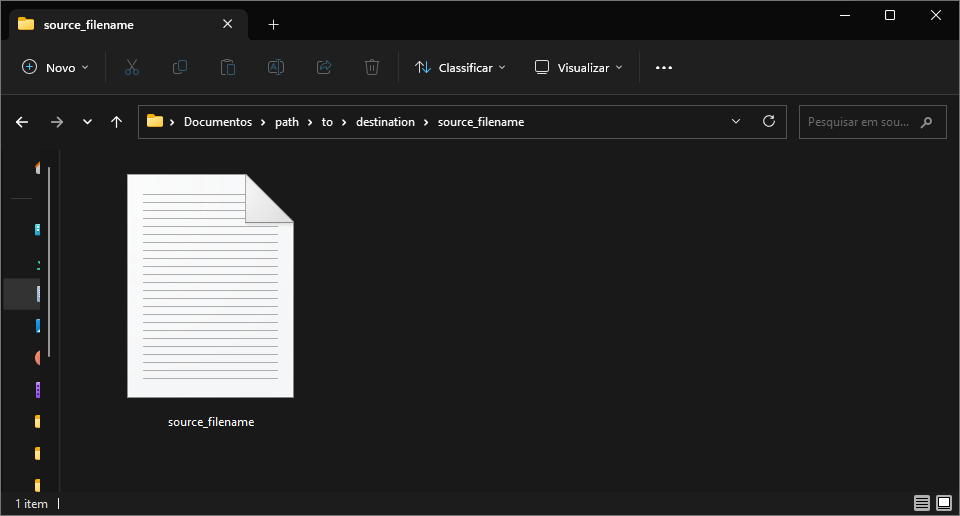
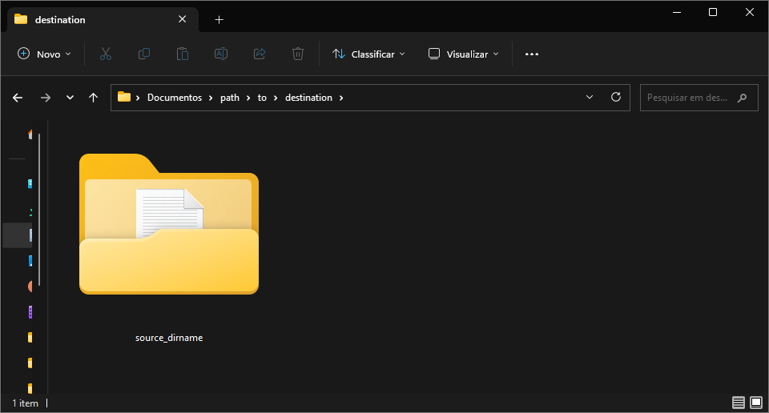
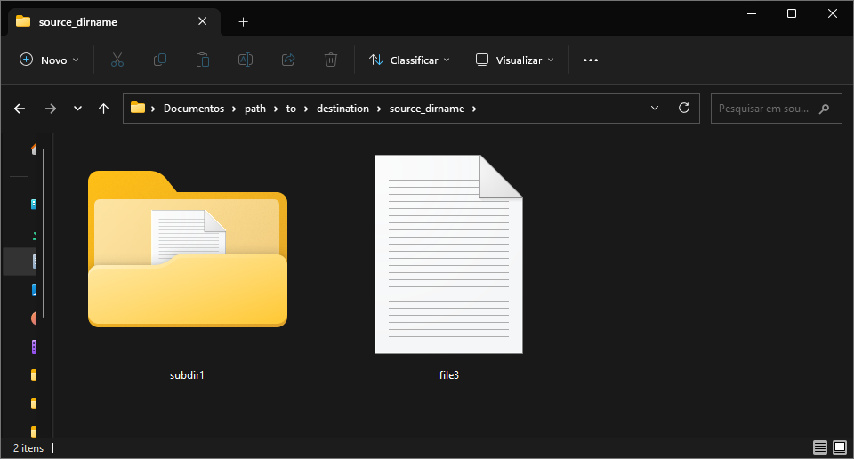

# Tutorial
If you have made it this far, it means you want to learn more about Backup Juggler.

The goal of this project is to help users who need to make multiple copies of files and directories simultaneously. It provides features such as performing backups and calculating the total size of the specified source(s) distributed in subcommand of our cli.

## Features
Backup Juggler distributes each function into a subcommand and you can run each one to test it now. The purpose of this tutorial is to explain the basics of how the command line application works.

The subcommands are divided into two functions so far: `do-backups` and `get-size`.

Now, let's understand what each one is intended to do.

### Using `do-backups`
The `do-backups` subcommand helps us make it easier to perform backups from source(s) to destination(s).

```bash
{{ commands.run }} do-backups --source <source_path> --destination <destination_directory>
```

- `--source` or `-s` option specifies the source path(s) to be backed up;
- `--destination` or `-d` option specifies the destination directory(s) for the backups.

You can specify the source **as a file** or **as an entire directory**:

1. **As a file**:
```bash
{{ commands.run }} do-backups --source '/path/to/source.txt' --destination '/path/to/destination'
```
With that, a progress bar will be provided on the terminal so you can track the progress of the file backup process:
```bash
Copying source.txt to destination: 100%|████████████████████████████████████████████████████████████████████████████████████████████████████████████| 1.05M/1.05M [00:00<00:00, 108MB/s]
╭───────────────────────────────────────────────────────────────────────────────────────────────────────────────────────────────────────────────────────────────────────────────────────╮
│ Backup completed successfully: source.txt -> destination                                                                                                                              │
╰───────────────────────────────────────────────────────────────────────────────────────────────────────────────────────────────────────────────────────────────────────────────────────╯
```
In that example, the copy will be saved in a newly created directory inside the destination directory, using the same name as the file.



2. **As an entire directory**:
```bash
{{ commands.run }} do-backups --source '/path/to/source' --destination '/path/to/destination'
```
In that case, a progress bar will also be provided in the terminal so that you can follow the progress of the directory backup process:
```bash
Copying source to destination: 100%|████████████████████████████████████████████████████████████████████████████████████████████████████████████████| 3.15M/3.15M [00:00<00:00, 121MB/s]
╭───────────────────────────────────────────────────────────────────────────────────────────────────────────────────────────────────────────────────────────────────────────────────────╮
│ Backup completed successfully: source -> destination                                                                                                                                  │
╰───────────────────────────────────────────────────────────────────────────────────────────────────────────────────────────────────────────────────────────────────────────────────────╯
```
And the entire source directory will be copied recursively into the destination directory



!!! warning "About the sources"
        If the paths specified as sources for the backups do not exist, the `FileNotFoundError` exception will be raised. So make sure you enter the paths correctly.


#### How to make multiple backups
If you need to specify more than one source or destination, you can call both options multiple times.


1. Single source to multiple destinations
This allows multiple target directories for backups.
```bash
{{ commands.run }} do-backups --source 'c:/Users/mfsra/Documents/path/to/source.txt' --destination 'c:/Users/mfsra/Documents/path/to/destination1' --destination 'c:/Users/mfsra/Documents/path/to/destination2'
```
The source will be copied simultaneously to the two specified destination directories
```bash
Copying source.txt to destination1: 100%|███████████████████████████████████████████████████████████████████████████████████████████████████████████| 1.05M/1.05M [00:00<00:00, 350MB/s]
╭───────────────────────────────────────────────────────────────────────────────────────────────────────────────────────────────────────────────────────────────────────────────────────╮
│ Backup completed successfully: source.txt -> destination1                                                                                                                             │
╰───────────────────────────────────────────────────────────────────────────────────────────────────────────────────────────────────────────────────────────────────────────────────────╯
Copying source.txt to destination2: 100%|███████████████████████████████████████████████████████████████████████████████████████████████████████████| 1.05M/1.05M [00:00<00:00, 263MB/s] 
╭───────────────────────────────────────────────────────────────────────────────────────────────────────────────────────────────────────────────────────────────────────────────────────╮
│ Backup completed successfully: source.txt -> destination2                                                                                                                             │
╰───────────────────────────────────────────────────────────────────────────────────────────────────────────────────────────────────────────────────────────────────────────────────────╯
```
2. Multiple sources to a single destination
This allows you to backup from multiple sources.
```bash
{{ commands.run }} do-backups --source 'c:/Users/mfsra/Documents/path/to/source1.txt' --source 'c:/Users/mfsra/Documents/path/to/source2.txt' --destination 'c:/Users/mfsra/Documents/path/to/destination'
```
The two specified sources will be copied simultaneously into the same destination directory
```bash
Copying source1.txt to destination: 100%|███████████████████████████████████████████████████████████████████████████████████████████████████████████| 1.05M/1.05M [00:00<00:00, 111MB/s]
╭───────────────────────────────────────────────────────────────────────────────────────────────────────────────────────────────────────────────────────────────────────────────────────╮
│ Backup completed successfully: source1.txt -> destination                                                                                                                             │
╰───────────────────────────────────────────────────────────────────────────────────────────────────────────────────────────────────────────────────────────────────────────────────────╯
Copying source2.txt to destination: 100%|██████████████████████████████████████████████████████████████████████████████████████████████████████████| 1.05M/1.05M [00:00<00:00, 91.4MB/s] 
╭───────────────────────────────────────────────────────────────────────────────────────────────────────────────────────────────────────────────────────────────────────────────────────╮
│ Backup completed successfully: source2.txt -> destination                                                                                                                             │
╰───────────────────────────────────────────────────────────────────────────────────────────────────────────────────────────────────────────────────────────────────────────────────────╯
```
3. Multiple sources to multiple destinations
This allows you to backup multiple sources to multiple target directories
```bash
{{ commands.run }} do-backups --source 'c:/Users/mfsra/Documents/path/to/source1.txt' --source 'c:/Users/mfsra/Documents/path/to/source2.txt' --destination 'c:/Users/mfsra/Documents/path/to/destination1' --destination 'c:/Users/mfsra/Documents/path/to/destination2'
```
Each of the specified sources will be copied into each of the specified destination directories
```bash
Copying source1.txt to destination2: 100%|██████████████████████████████████████████████████████████████████████████████████████████████████████████| 1.05M/1.05M [00:00<00:00, 350MB/s]
╭───────────────────────────────────────────────────────────────────────────────────────────────────────────────────────────────────────────────────────────────────────────────────────╮
│ Backup completed successfully: source1.txt -> destination2                                                                                                                            │
╰───────────────────────────────────────────────────────────────────────────────────────────────────────────────────────────────────────────────────────────────────────────────────────╯
Copying source2.txt to destination2: 100%|██████████████████████████████████████████████████████████████████████████████████████████████████████████| 1.05M/1.05M [00:00<00:00, 263MB/s]
╭───────────────────────────────────────────────────────────────────────────────────────────────────────────────────────────────────────────────────────────────────────────────────────╮
│ Backup completed successfully: source2.txt -> destination2                                                                                                                            │
╰───────────────────────────────────────────────────────────────────────────────────────────────────────────────────────────────────────────────────────────────────────────────────────╯
Copying source2.txt to destination1: 100%|██████████████████████████████████████████████████████████████████████████████████████████████████████████| 1.05M/1.05M [00:00<00:00, 263MB/s]
╭───────────────────────────────────────────────────────────────────────────────────────────────────────────────────────────────────────────────────────────────────────────────────────╮
│ Backup completed successfully: source2.txt -> destination1                                                                                                                            │
╰───────────────────────────────────────────────────────────────────────────────────────────────────────────────────────────────────────────────────────────────────────────────────────╯
Copying source1.txt to destination1: 100%|██████████████████████████████████████████████████████████████████████████████████████████████████████████| 1.05M/1.05M [00:00<00:00, 210MB/s] 
╭───────────────────────────────────────────────────────────────────────────────────────────────────────────────────────────────────────────────────────────────────────────────────────╮
│ Backup completed successfully: source1.txt -> destination1                                                                                                                            │
╰───────────────────────────────────────────────────────────────────────────────────────────────────────────────────────────────────────────────────────────────────────────────────────╯
```

### Using `get-size`
The `get-size` subcommand helps us to calculate the total size of the specified source(s).

```bash
{{ commands.run }} get-size --source <source_path>
```

- `--source` or `-s` option specifies the source path(s) that will have their total sizes calculated.

You can specify the source **as a file** or **as an entire directory**:

1. **As a file**:
```bash
{{ commands.run }} get-size --source '/path/to/source.txt'
```
That will return the total size of the specified file source:
```bash
╭─────────────────────╮
│ Total size: 1.00 MB │
╰─────────────────────╯
```
2. **As an entire directory**:
```bash
{{ commands.run }} get-size --source '/path/to/source'
```
In that case, it will return the total size of the specified directory source:
```bash
╭─────────────────────╮
│ Total size: 3.00 MB │
╰─────────────────────╯
```
It will get the size of each file in the directory recursively, returning the total size.

!!! warning "About the sources"
    If the paths specified as sources that will have their total sizes calculated do not exist, the `FileNotFoundError` exception will be raised. So make sure you enter the paths correctly.

#### How to calculate from multiple sources
If you need to specify more than one source, you can call the `--source` or `-s` option multiple times to get their total size.

```bash
{{ commands.run }} get-size --source 'c:/Users/mfsra/Documents/path/to/source1.txt' --source 'c:/Users/mfsra/Documents/path/to/source2.txt'
```

That will calculate the size of each of the sources and then return the sum of their total sizes

```bash
╭─────────────────────╮
│ Total size: 2.00 MB │
╰─────────────────────╯
```

## To learn more

### If the subcommands are invoked without any options?
If the subcommands are invoked without any options, it will return an error message. An example with the `do-backups` subcommand:

```bash
{{ commands.run }} do-backups
```
```bash
Usage: bj do-backups [OPTIONS]
Try 'bj do-backups --help' for help.
╭─ Error ─────────────────────────────────────────────╮
│ Missing option '--source' / '-s'.                   │
╰─────────────────────────────────────────────────────╯
```

### About more uses for the features

If you want to discover more uses for the features, you can use the `--help` flag in all subcommands.

That way you can discover new ways to use Backup Juggler:

```bash
{{ commands.run }} [comando] --help
```

## About the tutorial

This tutorial was last updated on `2023-06-30`, the commands may receive new updates. So checking the --help is a good way to keep up-to-date.

If you have found any errors in the tutorial or want to improve the text. Feel free to contribute to the project at the following link:

[How to contribute to the project?](/contribute/)